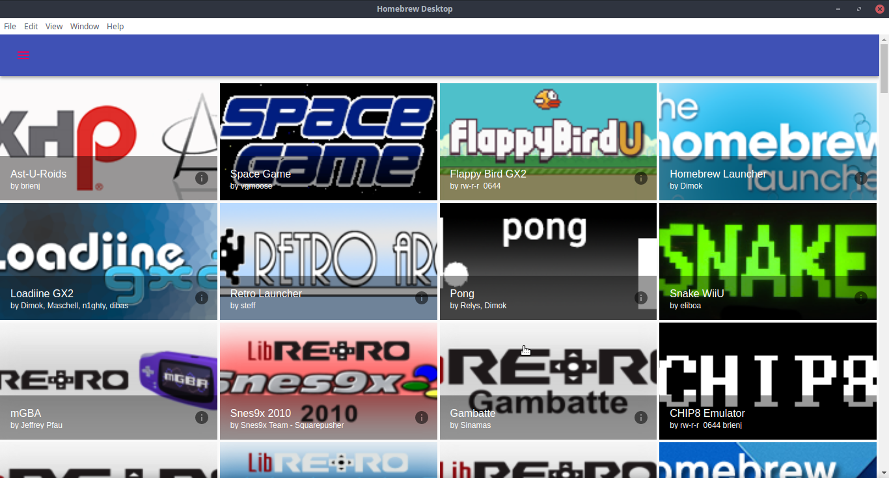
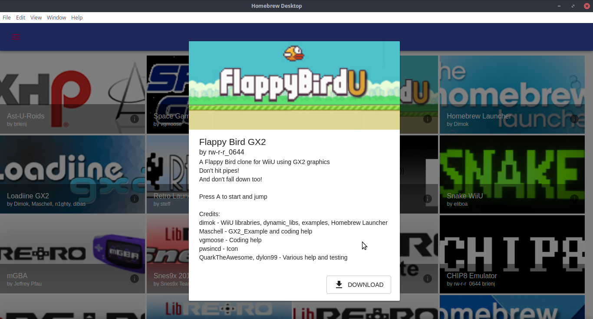
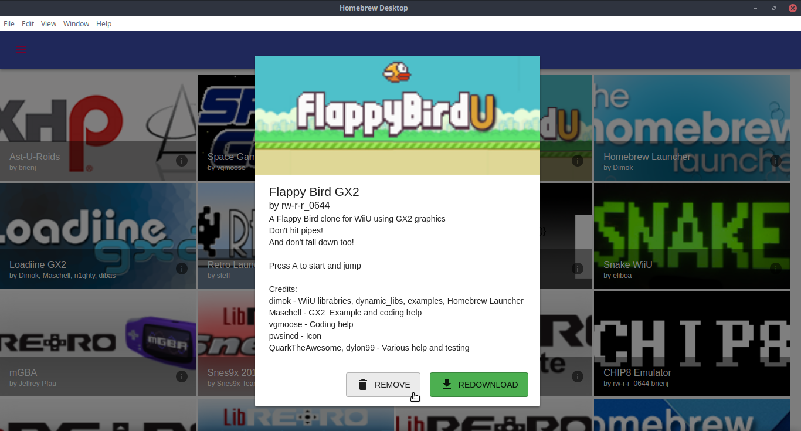

# Homebrew Desktop

An app that allows you to manage your Homebrewed Wii U's SD card from a computer.

## Screenshots

## Building

1.  Ensure that you have [node.js](https://nodejs.org/en/download/), and preferably
    [git](https://git-scm.com/downloads) and [yarn](https://yarnpkg.com/en/docs/install) installed.
2.  Either clone this repo using git from the command line
    (`git clone https://github.com/coolreader18/homebrew-desktop`), some other method of using git,
    or click the "Clone or download" button near the top right of the GitHub website.
3.  Install dependencies. If you did install yarn, run `yarn`, or `npm install` if you didn't, from
    the command line in the homebrew-desktop directory. Wait a while.
4.  Run `yarn start` or `npm start`. The app should start up.

## License

This project is licensed under the MIT license. See the [LICENSE](LICENSE) file for more details.
